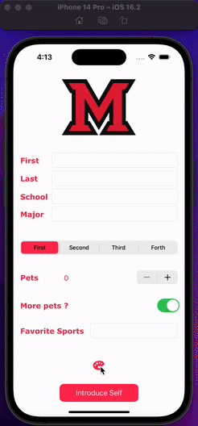

## Introduction Self App

### App Description

This is a functional application that takes inputs from the users and gives a basic introduction using foundation Swift components. 

### App Walk-though

### Required Features

- [x] 1. App displays an image of a school's logo
- [x] 2. App has three textfields for first, last, and school names
- [x] 3. App has a segmented control that changes student year
- [x] 4. Number of pet matches label is increased/decreased by stepper
- [x] 5. Switch makes a statement about wanting more pets or not(true/false) 
- [x] 6. Introduce yourself button shows alert box with an introduciton and dismiss button

### Optional Features

- [x] 1. User can tap a button to change the color of the background view among white, lightgrey, cyan, and teal 
- [x] 3. User can select on additional buttons that provide more info about the user. Example: more textfields providing more information.
- [x] 4. Any stylistic changes that are not default options (Change the system color to be pink to make it consistent with the school logo)
